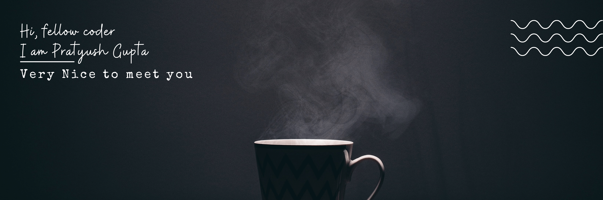

# Welcome to &nbsp;&nbsp;&nbsp;&nbsp;&nbsp; for everyone
Yes, this wordle is open for everyone to play **together**, cause only together we can uncover the hidden letters 😊.

<!-- BOARD START -->
&nbsp;&nbsp;&nbsp;&nbsp;&nbsp; &nbsp;&nbsp;&nbsp;&nbsp;&nbsp; &nbsp;&nbsp;&nbsp;&nbsp;&nbsp; &nbsp;&nbsp;&nbsp;&nbsp;&nbsp; &nbsp;&nbsp;&nbsp;&nbsp;&nbsp; &nbsp;&nbsp;&nbsp;&nbsp;&nbsp; 

<!-- BOARD END -->

<!--  -->
TO GUESS NEW WORD: [Click Here](https://github.com/pratyushgguptaa/pratyushgguptaa/issues/new?body=Just+enter+a+5+letter+word+in+the+title+after+%22WORDLE%3A+%22+and+click+%22Submit+new+issue%22.+You+don%27t+need+to+do+anything+else+%3AD&title=WORDLE%3A+) 

After game over: [Click Here](https://github.com/pratyushgguptaa/pratyushgguptaa/issues/new?title=WORDLE%3A+START+NEW+GAME&body=Dont+change+the+title.+If+the+game+is+over+new+game+will+be+loaded) to reset the board and start a new game!

  
Statistics

<!-- STATS START -->
| 0 | 0 | 0 | 0 | 
|:---:|:---:|:---:|:---:|
| Played | Win % | Current Streak | Max Streak | 
<!-- STATS END -->

  
Top 10 players with most guesses

<!-- BEGIN TOP GUESSES -->
<!-- END TOP GUESSES -->

