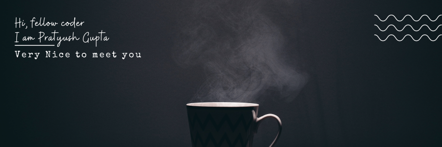

# Welcome to &nbsp;&nbsp;&nbsp;&nbsp;&nbsp; for everyone
Yes, this wordle is open for everyone to play **together**, cause only together we can uncover the hidden letters 😊.

<!-- BOARD START -->

&nbsp;&nbsp;&nbsp;&nbsp;&nbsp; &nbsp;&nbsp;&nbsp;&nbsp;&nbsp; &nbsp;&nbsp;&nbsp;&nbsp;&nbsp; &nbsp;&nbsp;&nbsp;&nbsp;&nbsp; &nbsp;&nbsp;&nbsp;&nbsp;&nbsp; &nbsp;&nbsp;&nbsp;&nbsp;&nbsp; 

<!-- BOARD END -->

## How to play?
<!-- DETAILS START -->
Looks like its game over. [Click Here](https://github.com/pratyushgguptaa/pratyushgguptaa/issues/new?title=WORDLE%3A+START+NEW+GAME&body=Dont+change+the+title.+If+the+game+is+over+new+game+will+be+loaded) to reset the board and start a new game. You will be directed to the **Create New Issue** page with a default title ready for you: `WORDLE: START NEW GAME`. You do not need to change anything just create a new issue. Come back here and refresh after a minute or two a new game will be loaded, with a brand new hidden word 👀.
<!-- DETAILS END -->

## What is this game?
There is a secret 5-letter word that you need to find. Make guesses and observe which letters are:
- `Not Present` in the hidden word (colored: )
- `Present` but not in the correct position (colored: )
- `Present` and in the right position (colored: )

Remember, you have to make it all  😉.

  
WORDLE STATISTICS

<!-- STATS START -->
| 9 | 77 | 1 | 4 | 
|:---:|:---:|:---:|:---:|
| Played | Win % | Current Streak | Max Streak | 
<!-- STATS END -->

  
GUESSES DISTRIBUTION

<!-- GUESSES START -->
1.  1
2.  0
3.  3
4.  1
5.  2
6.  0

<!-- GUESSES END -->
 
  

  
The TOP 10 players with most guesses

<!-- TOP START -->
| Player | Guesses |
|:---:|:---:|
| [@NikharManchanda](https://github.com/NikharManchanda) | 9 |
| [@pratyushgguptaa](https://github.com/pratyushgguptaa) | 8 |

<!-- TOP END -->

